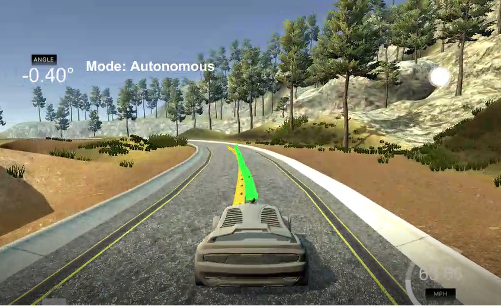
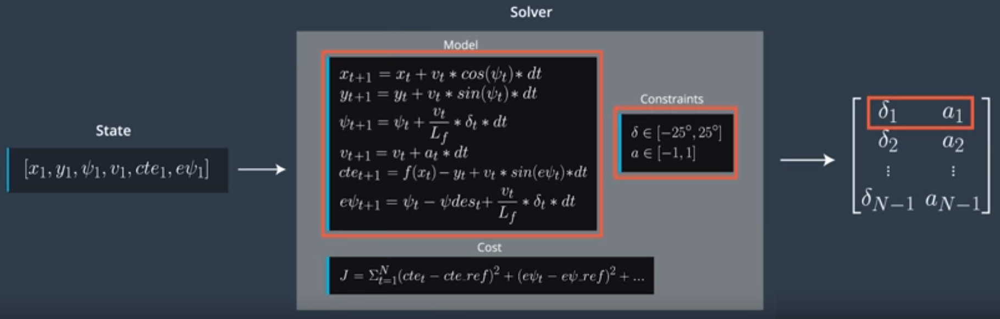

# Model Predictive Controller

## Introduction:
#### The goal for this project is to use a Model Predictive Controller (MPC) to optimize a car's trajectory so it could navigate its way around a track in Udacity's simulator environment. 

#### The simulator uses a websocket to transmit the following information to the MPC: x and y waypoints, the vehicle orientation, the vehicles' global position x and y in meters, the steering angle in radians, the throttle position, and the vehicle's speed in mph.

#### As seen in Fig 1, the yellow line represents the waypoints from the simulator (the reference trajectory) and the green line is the best polynomial fit to the reference trajectory which is computed by the MPC.


#### ->Fig 1<-


## The Model:


#### ->Fig 2(Source: Udacity)<-

#### The state information is stored in a vector. It contains: the vehicle position (x & y coordinates), psi (orientation of the vehicle), velocity (v), Cross Track Error (CTE), and psi error (epsi) which is the difference between the predicted orientation of the vehicle and the orientation of the MPC's trajectory. 

#### The actuator information is also stored in a vector which contains the steering angle (psi), & throttle/brake information. The steering angle is limited to -25 to 25 degrees, whereas the throttle/brake is limited to -1 to +1. A negative throttle value indicates breaking whereas a positive value indicates acceleration.

#### As shown in Figure 2, the current state is first passed to the MPC. The optimization solver (IPOPT solver was used) is then called which in turn uses the initial state, the model update equations, constraints, and the cost function to return a vector with control inputs that minimizes the cost function. The first control input is applied to the vehicle and the vehicle proceeds to the next state. This process is repeated in a loop.

## Timestep Length and Elapsed Duration (N & dt):

#### I chose a timestep length (N) of 10 and elapsed duration (dt) of 0.1 for the MPC. This translates to a prediction horizon of 1 second which is a good compromise between computational resources and accuracy. We don't need a prediction horizon further than 1 second since we are not going to use those values anyway to determine the next state. A higher N also adds to computational resources since more calculations need to be done if dt remains the same. The choice of 0.1 for dt results in actuations every 100ms which is good enough for this exercise. Smaller dt gives better resolution but for the speed range (targeting < 100mph) of the vehicle in this track, higher resolution than 0.1 is unnecessary. Other values tried were (N=20, dt=0.1), (N=10, dt=0.05), & (N=5, dt=0.1).

## Cost function & weights:

#### The cost function is the sum of the following integrated over all the timesteps and the goal is to minimize this:
#### -CTE
#### -Orientation error
#### -Steering angle & Throttle
#### -Rate of change of steering angle & Throttle

#### Our primary goal is to reduce CTE & Orientation error and I assigned high weights to these components so the solver pays more attention to reduce these error components.
#### Furthermore, I wanted to make sure that the ride is smooth without sudden changes in acceleration or steering. So, I assigned weights after some trail and error to address these concerns.

#### The final weights assigned were (lines 52-72 in MPC.cpp):

|          Cost Component          |    Weight    |
|:--------------------------------:|:------------:|
|CTE|2000|
|epsi|2000|
|speed|1|
|steering angle|25|
|Throttle|25|
|Rate of change of steering angle|200|
|Rate of change of throttle|20|


## Polynomial Fitting and MPC Preprocessing:

#### The waypoints were transformed into the vehicle's local coordinate system (lines 101-109: main.cpp). I used a 3rd order polynomial to fit the reference trajectory as it is a good approximation for most roads.


## Model Predictive Control with Latency:

#### To address the latency (caused by the response delay of the system in implementing the commands) of the kinematic model which is 100ms, I predicted the latency 100ms ahead of time using the current state as shown in lines 129-139 (main.cpp), before feeding the current state to the solver to predict the next state.

## Results:

#### The end result can be viewed here: [video](https://youtu.be/Xabr6ZLxCX8). I used a reference velocity of 75mph in my solution and the car reaches 60mph on the track. However, the MPC can be tuned to work at higher speeds by tuning the weights for the cost function components. 

#### The following instructions need to be followed if you would like to run this code yourself:
## Dependencies

* cmake >= 3.5
 * All OSes: [click here for installation instructions](https://cmake.org/install/)
* make >= 4.1(mac, linux), 3.81(Windows)
  * Linux: make is installed by default on most Linux distros
  * Mac: [install Xcode command line tools to get make](https://developer.apple.com/xcode/features/)
  * Windows: [Click here for installation instructions](http://gnuwin32.sourceforge.net/packages/make.htm)
* gcc/g++ >= 5.4
  * Linux: gcc / g++ is installed by default on most Linux distros
  * Mac: same deal as make - [install Xcode command line tools]((https://developer.apple.com/xcode/features/)
  * Windows: recommend using [MinGW](http://www.mingw.org/)
* [uWebSockets](https://github.com/uWebSockets/uWebSockets)
  * Run either `install-mac.sh` or `install-ubuntu.sh`.
  * If you install from source, checkout to commit `e94b6e1`, i.e.
    ```
    git clone https://github.com/uWebSockets/uWebSockets
    cd uWebSockets
    git checkout e94b6e1
    ```
    Some function signatures have changed in v0.14.x. See [this PR](https://github.com/udacity/CarND-MPC-Project/pull/3) for more details.

* **Ipopt and CppAD:** Please refer to [this document](https://github.com/udacity/CarND-MPC-Project/blob/master/install_Ipopt_CppAD.md) for installation instructions.
* [Eigen](http://eigen.tuxfamily.org/index.php?title=Main_Page). This is already part of the repo so you shouldn't have to worry about it.
* Simulator. You can download these from the [releases tab](https://github.com/udacity/self-driving-car-sim/releases).
* Not a dependency but read the [DATA.md](./DATA.md) for a description of the data sent back from the simulator.


## Basic Build Instructions

1. Clone this repo.
2. Make a build directory: `mkdir build && cd build`
3. Compile: `cmake .. && make`
4. Run it: `./mpc`.

## Tips

1. It's recommended to test the MPC on basic examples to see if your implementation behaves as desired. One possible example
is the vehicle starting offset of a straight line (reference). If the MPC implementation is correct, after some number of timesteps
(not too many) it should find and track the reference line.
2. The `lake_track_waypoints.csv` file has the waypoints of the lake track. You could use this to fit polynomials and points and see of how well your model tracks curve. NOTE: This file might be not completely in sync with the simulator so your solution should NOT depend on it.
3. For visualization this C++ [matplotlib wrapper](https://github.com/lava/matplotlib-cpp) could be helpful.)
4.  Tips for setting up your environment are available [here](https://classroom.udacity.com/nanodegrees/nd013/parts/40f38239-66b6-46ec-ae68-03afd8a601c8/modules/0949fca6-b379-42af-a919-ee50aa304e6a/lessons/f758c44c-5e40-4e01-93b5-1a82aa4e044f/concepts/23d376c7-0195-4276-bdf0-e02f1f3c665d)
5. **VM Latency:** Some students have reported differences in behavior using VM's ostensibly a result of latency.  Please let us know if issues arise as a result of a VM environment.

## Editor Settings

We've purposefully kept editor configuration files out of this repo in order to
keep it as simple and environment agnostic as possible. However, we recommend
using the following settings:

* indent using spaces
* set tab width to 2 spaces (keeps the matrices in source code aligned)

## Code Style

Please (do your best to) stick to [Google's C++ style guide](https://google.github.io/styleguide/cppguide.html).

## Project Instructions and Rubric

Note: regardless of the changes you make, your project must be buildable using
cmake and make!

More information is only accessible by people who are already enrolled in Term 2
of CarND. If you are enrolled, see [the project page](https://classroom.udacity.com/nanodegrees/nd013/parts/40f38239-66b6-46ec-ae68-03afd8a601c8/modules/f1820894-8322-4bb3-81aa-b26b3c6dcbaf/lessons/b1ff3be0-c904-438e-aad3-2b5379f0e0c3/concepts/1a2255a0-e23c-44cf-8d41-39b8a3c8264a)
for instructions and the project rubric.

## Hints!

* You don't have to follow this directory structure, but if you do, your work
  will span all of the .cpp files here. Keep an eye out for TODOs.

## Call for IDE Profiles Pull Requests

Help your fellow students!

We decided to create Makefiles with cmake to keep this project as platform
agnostic as possible. Similarly, we omitted IDE profiles in order to we ensure
that students don't feel pressured to use one IDE or another.

However! I'd love to help people get up and running with their IDEs of choice.
If you've created a profile for an IDE that you think other students would
appreciate, we'd love to have you add the requisite profile files and
instructions to ide_profiles/. For example if you wanted to add a VS Code
profile, you'd add:

* /ide_profiles/vscode/.vscode
* /ide_profiles/vscode/README.md

The README should explain what the profile does, how to take advantage of it,
and how to install it.

Frankly, I've never been involved in a project with multiple IDE profiles
before. I believe the best way to handle this would be to keep them out of the
repo root to avoid clutter. My expectation is that most profiles will include
instructions to copy files to a new location to get picked up by the IDE, but
that's just a guess.

One last note here: regardless of the IDE used, every submitted project must
still be compilable with cmake and make./

## How to write a README
A well written README file can enhance your project and portfolio.  Develop your abilities to create professional README files by completing [this free course](https://www.udacity.com/course/writing-readmes--ud777).
